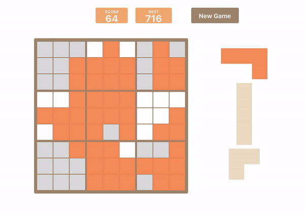

  <a href="https://meek-shortbread-13ef23.netlify.app/"><h1>TAKTRIS</h1></a> 
  

Match blocks to complete lines and squares to get them removed. Keep the board clean, and beat your high score.

 inspired by <a href="https://easybrain.com/">Blockudoku</a> and <a href="https://2048game.com/">2048</a> 

Clone down this repository. You will need `node` and `npm` installed globally on your machine. 
Installation: `npm install` 
To Start Server: `npm start` 
To Visit App: `localhost:3000`
